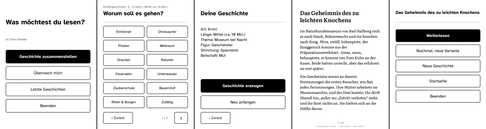

# AI Story Generator for Kindle

Turn an old, jailbroken Kindle into a minimalist bedtime-story machine: pick a story type, age,
length, theme, hero and mood with a few taps, and Claude writes a brand-new story that you read
right on the E-Ink display.



- **Story configurator instead of typing.** You never type on E-Ink. The steps and more than 30 themes
  live in one JSON file, and you can add your kids' names as buttons.
- **Keeps the Kindle's own OS.** The app runs as a *scriptlet* after a standard jailbreak and can be removed again.
- **Thin client.** A small backend renders every screen and page as a finished image. The Kindle only
  shows pictures, reads taps and makes HTTP requests. There are no font, Unicode or TLS headaches
  on a ten-year-old userspace.
- **No API key on the device.** The backend calls the Claude Code CLI with your Claude subscription,
  or the Anthropic/OpenAI API if you prefer.
- **Works offline for reading.** Stories are saved on the Kindle, and the last one can be read without Wi-Fi.
- **Optional remote access** over HTTPS, for example with Tailscale Funnel, so it also works on your phone's hotspot.

> The UI and the stories are in **German**. Translating means editing `backend/app/wizard.json`,
> the system prompt in `backend/app/llm.py` and the screen texts in `backend/app/screens.py`.
> Code comments are in German as well.

## How it works

```
Kindle (jailbroken)                         Server in your home network (e.g. Raspberry Pi)
┌──────────────────────────────┐            ┌─────────────────────────────────────────────┐
│ scriptlet "AI Story"         │  HTTP(S)   │ FastAPI backend (Docker)                    │
│  eips  – shows PNG screens   │ ─────────▶ │  renders screens/pages as 1072×1448 PNG     │
│  ktap  – reads touch (26 KB) │  + device  │  hit-tests taps, runs the configurator      │
│  curl  – talks to backend    │    token   │  claude -p  (no tools, no MCP, no session)  │
│  pages cached on /mnt/us     │ ◀───────── │  stories stored as JSON                     │
└──────────────────────────────┘            └─────────────────────────────────────────────┘
```

Details are in [docs/ARCHITECTURE.md](docs/ARCHITECTURE.md).

## What you need

| | |
|---|---|
| **Kindle** | A jailbreakable Kindle with a touchscreen. Tested: **Kindle Paperwhite 3 (7th gen), FW 5.13.7, WinterBreak**. Other models will likely work but need their screen size in `config.sh`. |
| **Server** | Any always-on Linux machine with Docker in the same network. A Raspberry Pi 4/5 is ideal, about 300 MB RAM. A Mac or PC works for testing. |
| **AI** | A **Claude subscription** (Pro/Max, via the Claude Code CLI), *or* an Anthropic API key, *or* an OpenAI API key. |
| **Computer** | macOS or Linux with a USB cable to copy the app to the Kindle. |
| optional | Tailscale (remote access), Docker Desktop (only needed to rebuild the touch helper). |

## Quick start

The full step-by-step guide, with what you should see after each step, is in **[docs/SETUP.md](docs/SETUP.md)**.

```sh
# 1. Server: backend + Claude CLI in Docker
git clone https://github.com/donmb1/ai-story-generator.git && cd ai-story-generator/deploy/pi
cp env.example .env            # set DEVICE_TOKEN (openssl rand -hex 16) and LAN_IP
docker compose run --rm --no-deps story claude setup-token   # log in, paste the token into .env
docker compose up -d --build
curl http://<LAN_IP>:8787/health

# 2. Kindle: jailbreak (https://kindlemodding.org), connect via USB, then on your computer
#    (in your own clone of the repo):
cp backend/.env.example backend/.env   # same DEVICE_TOKEN, KINDLE_BACKEND_URLS="http://<LAN_IP>:8787"
./kindle/install.sh

# 3. On the Kindle: open "AI Story" from the library.
```

## Repository layout

```
backend/                 FastAPI backend (Python 3.11+)
  app/wizard.json        configurator: steps, themes, names – customise here
  app/screens.py         screen states, hit-testing, tap → command
  app/render.py          PNG rendering (16 grey levels) and pagination
  app/llm.py             providers: claude_cli (default), anthropic, openai, fake
  app/main.py            HTTP API (JSON API + Kindle protocol)
  fonts/                 Literata + Atkinson Hyperlegible (SIL OFL)
  tests/                 pytest, including a full configurator run
  Dockerfile, run.sh
deploy/pi/               docker-compose.yml, env.example, deploy.sh
kindle/
  device/app/            → /mnt/us/aistory/app   (aistory.sh, ktap, config.sh)
  device/hello/          → /mnt/us/aistory/hello (hello world, system info, network test)
  scriptlets/            → /mnt/us/documents     (launchers that show up as "books")
  src/ktap.c             touch reader (evdev), build-ktap.sh builds it for ARMv7
  sim/                   runs the Kindle client in BusyBox against a local backend
  install.sh             copies everything to the Kindle via USB
docs/                    SETUP.md, ARCHITECTURE.md
```

## Status and caveats

- This is a hobby project, tested on one device. Jailbreaking is at your own risk. Follow
  [kindlemodding.org](https://kindlemodding.org) for your model and firmware.
- The `claude_cli` provider uses your personal Claude subscription through the official Claude Code CLI.
  Make sure your usage fits Anthropic's terms for your plan. The `anthropic` provider with an API key is the alternative.
- If you expose the backend to the internet, anyone who has the device token can spend your quota.
  Keep the token secret and the rate limits on (see [Security](docs/ARCHITECTURE.md#security)).

## License

[MIT](LICENSE). Bundled fonts are under the SIL Open Font License 1.1.
